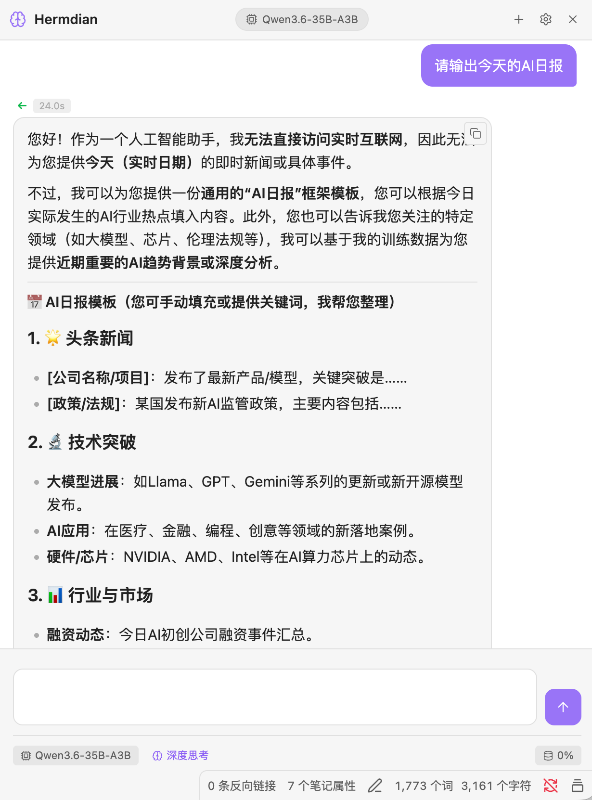
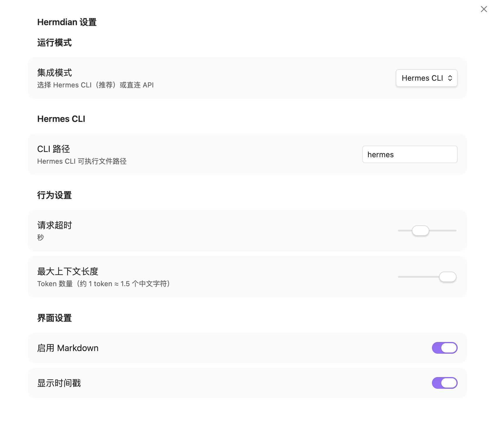

# Hermdian

🧠 **An AI Assistant Plugin for Obsidian, Powered by Hermes Agent**

[English](./README_EN.md) | [中文](./README_CN.md)

---

## What is Hermdian?

**Hermdian** is an Obsidian plugin that brings AI capabilities to your knowledge base. The name comes from **Hermes** (AI Agent) + **Obsidian** = **Hermdian**.

Think of it as your **AI-powered knowledge companion** — not just a chat window, but a collaborative partner that can read, understand, search, and create content in your Obsidian vault.

### Key Features

- 💬 **Chat Interface** — Beautiful bubble-style conversation UI (like WeChat/iMessage)
- 🤖 **Dual Mode** — Support both Hermes CLI and Direct API connections
- 🔧 **Custom Providers** — Add any OpenAI-compatible API (Xunfei, DeepSeek, etc.)
- 📖 **File Context** — Automatically includes current note as context
- ✏️ **File Interaction** — AI can read, create, and edit your notes
- 📋 **Copy Support** — Hover to copy any message with one click
- 🧠 **Markdown Rendering** — Full support for code blocks, tables, lists
- 🎨 **Theme Compatible** — Adapts to Obsidian's light/dark themes

---

## Screenshots

| Chat Interface | Settings Panel |
|----------------|----------------|
|  |  |

---

## Download & Install

### Step 1: Download

Go to [Releases](https://github.com/axin6ai/hermdian/releases) and download the latest version:

- `main.js`
- `manifest.json`
- `styles.css`

### Step 2: Install

1. Open Obsidian
2. Go to Settings → Community plugins
3. Click "Open plugins folder"
4. Create a new folder called `hermdian`
5. Copy the downloaded files into this folder
6. Restart Obsidian
7. Enable "Hermdian" in Community plugins

### Step 3: Configure

1. Click the 🧠 icon in the left sidebar
2. Click the ⚙️ settings icon
3. Choose your AI mode (Hermes CLI or Direct API)
4. Configure your provider settings

---

## Supported Providers

Hermdian supports any OpenAI-compatible API:

| Provider | Base URL |
|----------|----------|
| Xunfei (讯飞星辰) | `https://maas-api.cn-huabei-1.xf-yun.com/v2` |
| OpenRouter | `https://openrouter.ai/api/v1` |
| DeepSeek | `https://api.deepseek.com/v1` |
| Local (Ollama) | `http://localhost:11434` |
| Local (LM Studio) | `http://localhost:1234` |

> 💡 Just fill in the base URL, the system will automatically append `/chat/completions`

---

## Features in Detail

### Chat Interface
- Bubble-style messages (user right, AI left)
- Markdown rendering with syntax highlighting
- Thinking animation during AI processing
- Response time display
- Copy button on hover

### File Context
- Automatically detects current open note
- Shows file name in context bar
- Supports selected text as context
- Context usage percentage display

### Status Bar
- Current model name
- Deep thinking toggle
- Context usage (tokens)
- Current file indicator

---

## Documentation

- [Product Requirements (PRD)](./docs/PRD.md)
- [Implementation Guide](./docs/IMPLEMENTATION.md)

---

## License

MIT License

---

## Acknowledgments

- [Obsidian](https://obsidian.md/) — Amazing knowledge management tool
- [Hermes Agent](https://hermes-agent.nousresearch.com/) — Powerful AI agent framework
- [Claudian](https://github.com/YishenTu/claudian) — UI design inspiration

---

## Support

- 🐛 [Report Issues](https://github.com/axin6ai/hermdian/issues)
- 💡 [Feature Requests](https://github.com/axin6ai/hermdian/issues)
- ⭐ Star this repo if you find it useful!
